

Это учебный проект по разработке  приложения "Список дел".

Виды.
- Страница со списком всех заданий. В таблице отображаем имя, дату создания и состояние (выполнено или нет)
- На странице со списком добавить кнопку "Добавить задание".
- На странице со списком добавьте три ссылки: Все, Выполненные, Новые. При перевода по ссылкам в таблице нужно отображать: все задания, только выполненные или только новые.
- При клике на задание переходим на страницу с подробным описанием.
- На странице с подробным описанием добавить кнопки: Выполнено, Отредактировать, Удалить.
- Если нажали на кнокпу выполнить, то задание переводиться в состояние выполнено.
- Кнопка редактировать переводит пользователя на отдельную страницу для редактирования.
- Кнопка удалить, удаляет задание и переходит на список всех заданий.

Вид главной страницы приложения
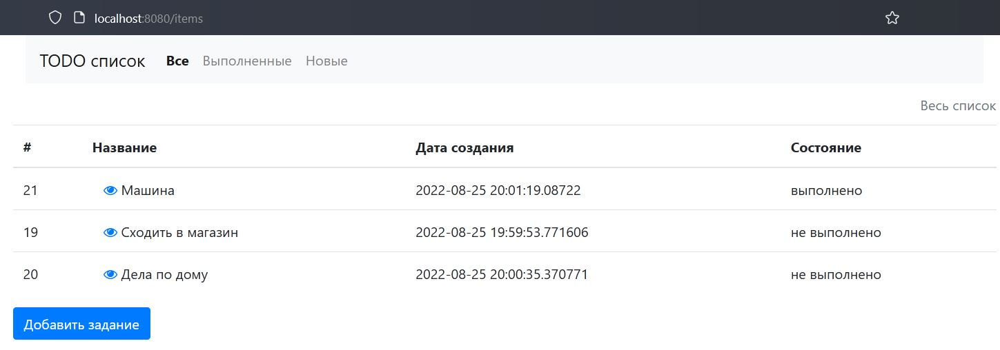

Вид страницы авторизации пользователя
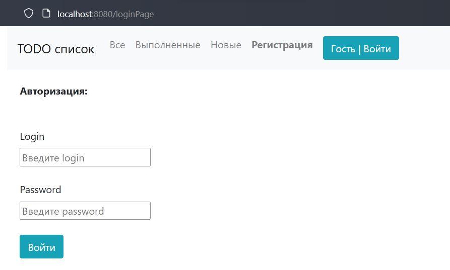

Вид страницы не успешной авторизации пользователя
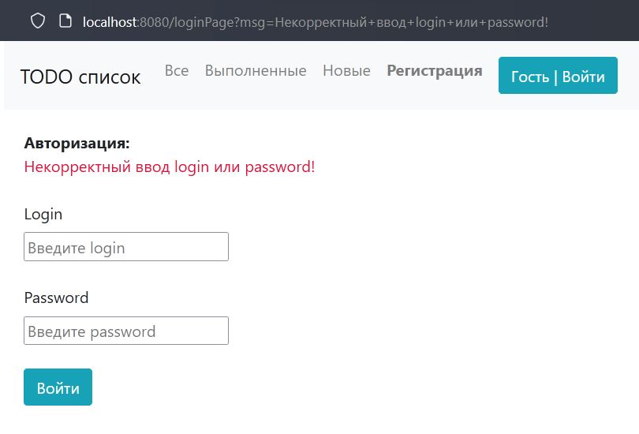

Вид страницы регистрации нового пользователя
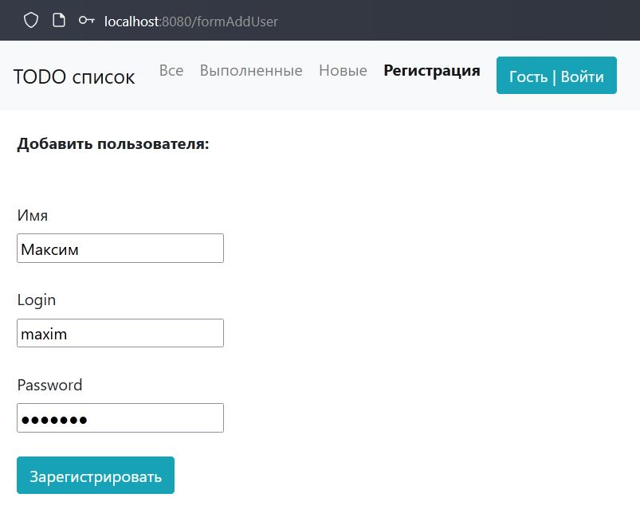

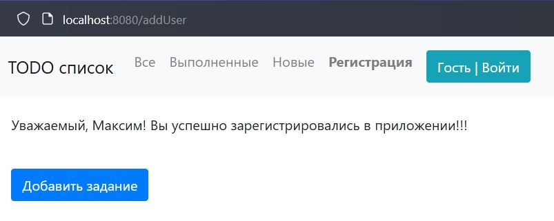

Вид страницы не успешной регистрации нового пользователя
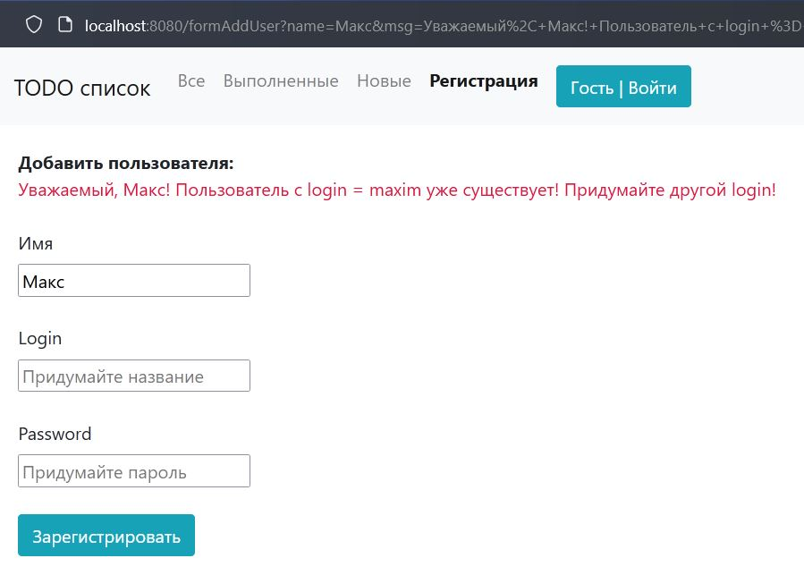

Вид страницы приложения по добавлению нового задания
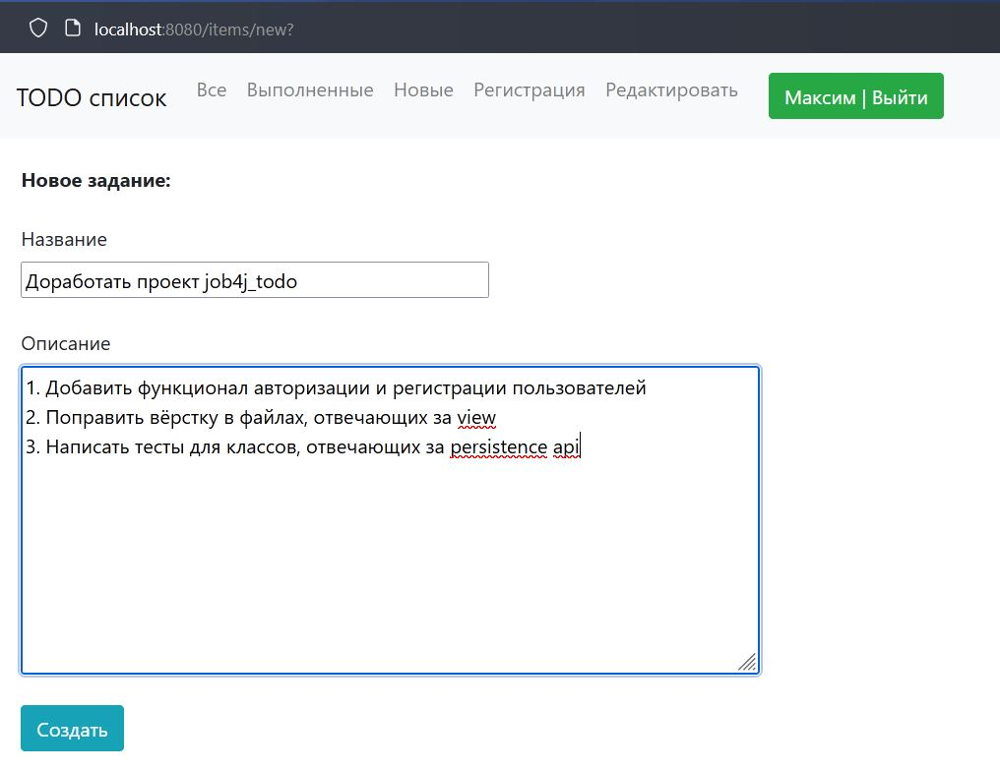

Вид страницы приложения с подробным описанием задания
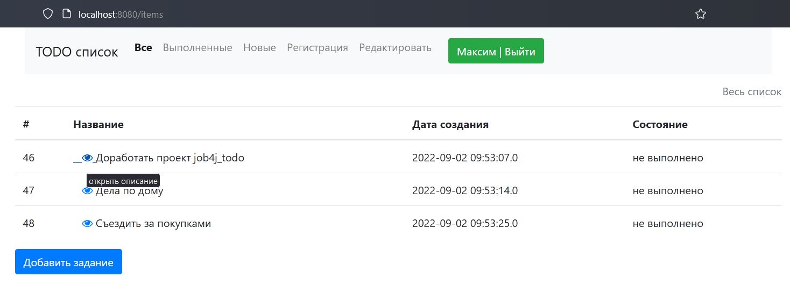

Страница описания задания
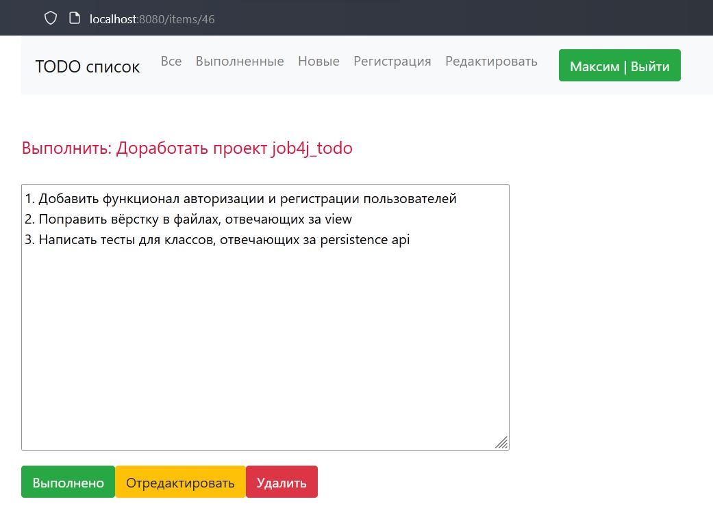

Вид страницы приложения для редактирования задания
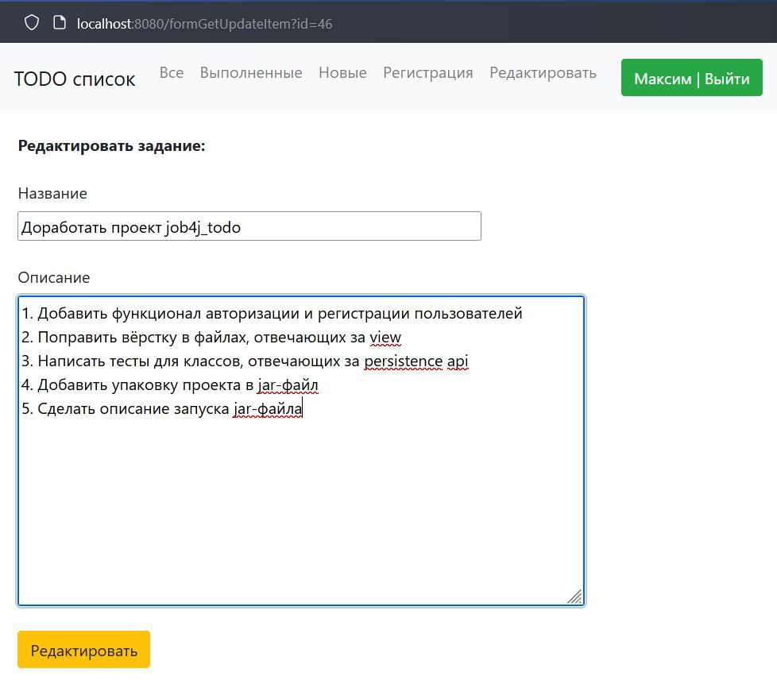

Вид страницы приложения для редактирования выполненного задания
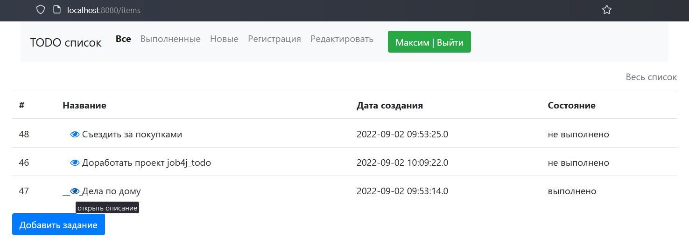

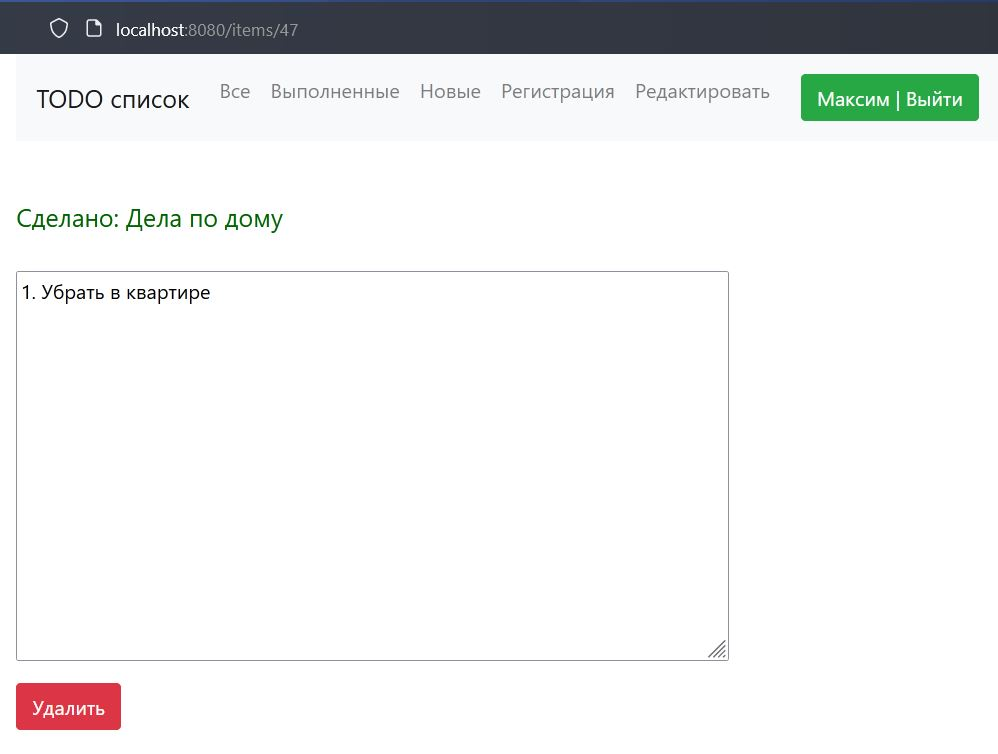

Виды страниц приложения с разбивкой по статусу выполнения

Все задания
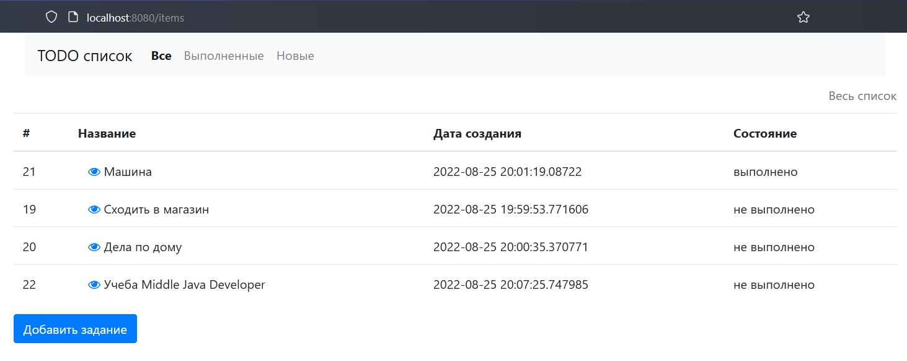

Выполненные задания
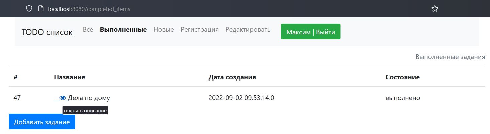

Новые задания
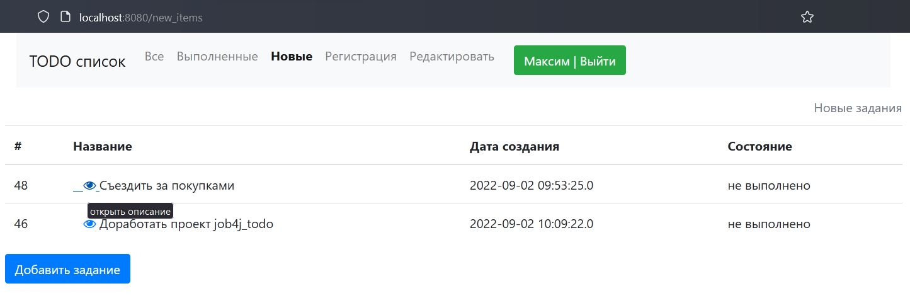

Используемые технологии в проекте:
- Spring boot.
- Thymeleaf.
- Bootstrap.
- Hibernate.
- Lombok.
- СУБД: PostgreSQL.
