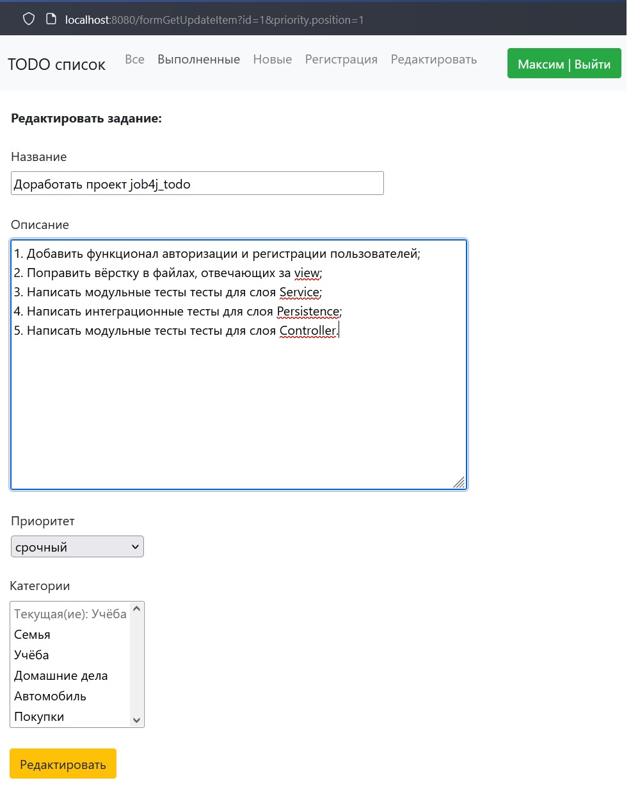

# Job4j_todo
#### Сервис "Сайт_Список дел"
[](https://app.travis-ci.com/MasterMaxTs/project_ToDoList)
[](https://codecov.io/gh/MasterMaxTs/project_ToDoList)

&nbsp;&nbsp;&nbsp;<br>
&nbsp;&nbsp;&nbsp;<br>
&nbsp;&nbsp;&nbsp;
&nbsp;&nbsp;&nbsp;
&nbsp;&nbsp;&nbsp;
&nbsp;&nbsp;&nbsp;<br>
&nbsp;&nbsp;&nbsp;
&nbsp;&nbsp;&nbsp;
&nbsp;&nbsp;&nbsp;
&nbsp;&nbsp;&nbsp;<br>
&nbsp;&nbsp;&nbsp;
&nbsp;&nbsp;&nbsp;
&nbsp;&nbsp;&nbsp;
&nbsp;&nbsp;&nbsp;<br>
&nbsp;&nbsp;&nbsp;
&nbsp;&nbsp;&nbsp;
&nbsp;&nbsp;&nbsp;
&nbsp;&nbsp;&nbsp;<br><br>
&nbsp;&nbsp;&nbsp;

### Это проект по созданию сайта "Список Дел", доступного в браузере.

Чтобы начать использовать функционал сайта, новому пользователю необходимо
пройти регистрацию:
   > Вкладка навигационного меню: _Регистрация_
   > * Ввод имени;
   > * Ввод login;
   > * Ввод Password;
   > * Уточнение местонахождения пользователя: выбор часового пояса на территории РФ
       (_опция отвечает за корректное отображение локального времени создания задачи пользователю_)
   
#### Данный проект позволит зарегистрированным пользователям:
1. Просматривать весь список личных дел (задач)
   > Вкладка навигационного меню: _Все_

2. Публиковать свои задачи
   > Кнопка: _Добавить задание_

3. Просматривать карточку задачи
   > Нажатие ЛКМ на иконку   в графе _Название_

4. Редактировать личные задачи
   > * Изменить содержимое: кнопка _Отредактировать_
   > * Изменить статус выполнения: кнопка _Выполнено_
   > * Удалить задачу: кнопка _Удалить_

5. Просматривать список выполненных задач
   > Вкладка навигационного меню: _Выполненные_

6. Просматривать список новых задач
   > Вкладка навигационного меню: _Новые_

7. Редактировать регистрационные данные профиля
   > Вкладка навигационного меню: _Профиль_

#### Администратору сайта доступно:
1. Просмотр сводных данных у зарегистрированных на сайте пользователей 
   > Вкладка навигационного меню: _Задачи пользователей_

2. Удалять профиль пользователя с очисткой связанных с ним данных
   > Нажатие ЛКМ на иконку   в графе _User_login_
---
### Стек технологий

- Java 11
- Maven 3.6.3
- Liquibase-maven-plugin v.4.15.0
- Spring-boot-starter-web v.2.7.3
- Spring-boot-starter-thymeleaf v.2.7.3
- Bootstrap v.4.4.1
- Hibernate-core v.5.6.11
- Lombok v.1.18.22
- СУБД: PostgreSQL v.14.0
<br/><br/>
- Тестирование:
   - junit v.4.13.2
   - hamcrest v.1.3
   - mockito-core v.4.9.0
   - БД: h2database v.2.1.214

---
### Требования к окружению
- Java 11
- Maven v.3.6.3
- PostgreSQL v.14.0

---
### Запуск проекта
1. Установить СУБД PostgreSQL


2. Создать базу данных с именем todo:
   ```create database todo;```


3. Скачать файлы проекта с github по ссылке и разархивировать в выбранную директорию:<br>
   [https://github.com/MasterMaxTs/project_ToDoList/archive](https://github.com/MasterMaxTs/project_ToDoList/archive/refs/heads/master.zip)


4. Перейти в директорию проекта, открыть командную строку и выполнить команды:
- Для <ins>первого</ins> запуска приложения выполнить последовательно команды:
    - ```mvn package -Pproduction -Dmaven.test.skip=true```
    - ```java -jar target/todo-1.0.war```
    - внизу окна командной строки скопировать в буфер обмена url:
      <br>http://localhost:8080/index


- Для <ins>последующего</ins> запуска приложения выполнять команду:
    - ```java -jar target/todo-1.0.war```
    - внизу окна командной строки скопировать в буфер обмена url:
      <br>http://localhost:8080/index


5. Вставить из буфера обмена url в адресную строку браузера:<br>
   [http://localhost:8080/index](http://localhost:8080/index)


6. В базу данных пользователей сайта добавлена одна учётная запись пользователя в роли Администратор.

   > администратору сайта необходимо выполнить вход в систему со следующими учётными данными и сменить пароль
   > * логин: _admin_
   > * пароль: _adm123_
> По умолчанию часовой пояс установлен _Europe/Moscow +3ч._

---
### Взаимодействие с приложением

1. Вид главной страницы приложения

    


2. Вид страницы регистрации нового пользователя

    


3. Вид страницы неуспешной регистрации нового пользователя

   


4. Вид страницы успешной регистрации нового пользователя

   


5. Вид страницы авторизации пользователя

   


6. Вид страницы не успешной авторизации пользователя

   

   
7. Вид страницы приложения по добавлению нового задания

   


8. Вид страницы приложения с подробным описанием задания

   


9. Вид страницы приложения для редактирования задания

    


10. Вид страницы приложения со всем списком заданий:

    


11. Вид страницы приложения с выполненным заданием:

    


12. Вид страницы приложения со списком новых заданий:

    


13. Вид страницы приложения со списком выполненных заданий:

    


14. Вид страницы приложения со списком всех зарегистрированных на сайте пользователей и сводной информацией о них:

    

---
### Контакты
* Email: java.dev-maxim.tsurkanov@yandex.ru
* Skype: https://join.skype.com/invite/ODADx0IJ3BBu
* VK: https://m.vk.com/id349328153
* Telegram: matsurkanov
